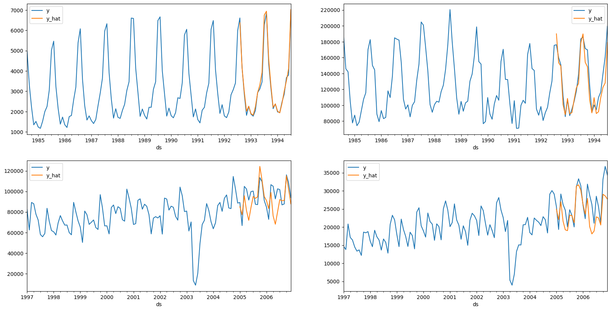

# Deconstucting DeepAR

This project is a partial reimplementation of the DeepAR model from the paper [DeepAR: Probabilistic Forecasting with Autoregressive Recurrent Networks](https://arxiv.org/abs/1704.04110) by David Salinas, Valentin Flunkert, Jan Gasthaus, and Tim Januschowski. The reference code for the implementation is from the Pytorch [GluonTS](https://ts.gluon.ai/stable/index.html). This project accompanies this [blog post](https://www.neuralaspect.com/posts/deepar/).

Why do we need another implementation of DeepAR?
I find the GluonTS implemntation a bit too complex with a lot of abstractions and long chains of code. I wanted investigate the model in detail to be able to conduct an abalation study and understand where the performance gains come from. Ultimately I came to the conclusion that it would be easier to reimplement the model from scratch, than
to fork the GluonTS codebase and hack around with that. 

What bits are the same?  
My aim was to create a model that trains and predicts in the same way as GluonTS with default parameters. This means that the model uses the same:  
    - LSTM architecture with 2 layers and 40 cells.   
    - Adam optimiser and Scheduler with the same parameters.  
    - Time dependent covariates.  
    - Mean absolute scaling  
    - Lag sequence  
    - Prediction length  
    - Context length  
    - Batch size, epochs, batches per epoch  
    - Train and test split  
    - Saving model on best training loss  

What bits are different?
    - The head of the model produces a point prediction rather than a distribution.  
    - Consequently the loss function is different (SmoothL1Loss)  
    - We don't use the GluonTS dataset sampler which has a bias towards sampling from shorter time series.  
    - We don't use the Static Features or the Categorical Embeddings primarily because they are set to constant values in the GluonTS implementation.  


## Datasets
I've run this project with the Tourism and Electricity datasets. 


Tourism sample test forecasts


## Requirements and Setup
Ensure you have the following installed:
- Python 3.x

Fork, clone or download the source code from the reppository into a directory on your machine and navigate to the projects | deepar directory
in a terminal window.

Run the following commmand to create a virutal environment, install the required packages and download the datasets.

```bash
make all
```

Activate the virtual environment
```bash
source covenv/bin/activate
```

Load the datasets
```bash
make sync_data_from_drive
```

## Training
To train the model(s) in the paper, run this command:
```bash
python deepar.py all all
```

Alternatively to train a specific model for a dataset, run this command
```bash
python train.py model_name dataset_name [data_path] [results_path] [generate_metrics]
```
Use the following options:

- models
    - deepar

- dataset_name
    - hospital
    - tourism
    - traffic
    - electricity

- data_path (default: data)

- results_path (eg results)

- generate_metrics
    - true
    - false

For example
```bash
python deepar.py deepar hospital 
```

This will create a folder where the results of each model will be stored along with the state_dict of the pytorch model weights created during training. 
Each execution of train creates a set of models covering a range of scenarios:

Each model will have a corresponding json file that contains the details of the scenario along with test error metrics including MASE, MAE, RMSE, and sMAPE. Once training has completed for all models a results.csv file will be generated which collates the json files for each scenario together to allow for further analysis.   

If you choose to generate metrics a selection of plots used in the paper as well as serialised model predictions and targets are saved into the chosen results directory. 

## Notebooks 
3 Jupyter notebooks are available for which also perform training of the same scenarios, but allow for greater control and customisation. 
 - 01-deepar-ablation.ipynb - Trains datasets using the deepar model with a point prediction head. 
 - 02-deepar-better.ipynb - Trains datasets using the deepar model with free running which gives ~2% point improvement in sMAPE. Also includes improved month and age features


## Naming Convention
The artifacts that are created in the results directory follow a specific naming convention:

scenario name: cov-{k}-lags-{l}-pl-{H}-[skip-1]-seed-{s}

Where:  
k - are the covariate names
l - are the number of lag values
H - Is the forecast horizon (prediction length)  
s - Is the seed number.  


