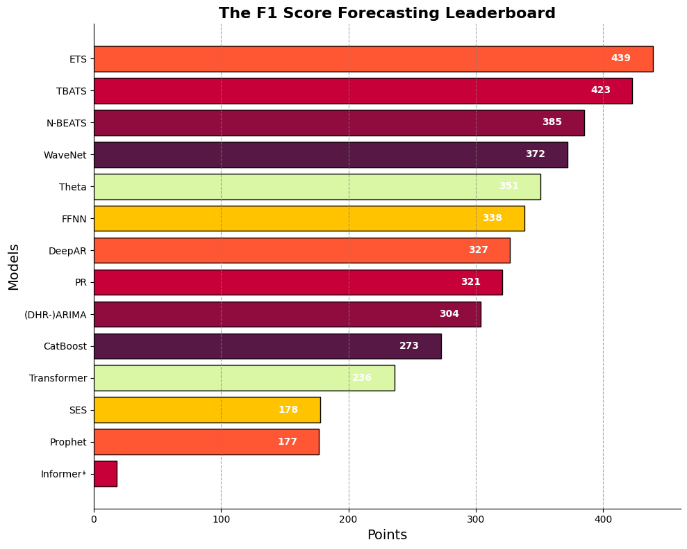

# 🏁 The F1 Score Forecasting Championship 🏁

This is a project which aims to compare to the performance of different timeseries forecasting models using the point system from the Formula 1 World Championship. 

| Position | Model        | Points | Engine |
|----------|--------------|--------|--------|     
| 1        | 🏎️ ETS         | 439    | ?    |
| 2        | 🏎️ TBATS       | 423    | ?    |
| 3        | 🏎️ N-BEATS     | 385    | ?    |
| 4        | 🏎️ WaveNet     | 372    | ?    |
| 5        | 🏎️ Theta       | 351    | ?    |
| 6        | 🏎️ FFNN        | 338    | ?    |
| 7        | 🏎️ DeepAR      | 327    | ?    |
| 8        | 🏎️ PR          | 321    | ?    |
| 9        | 🏎️ (DHR-)ARIMA | 304    | ?    |
| 10       | 🏎️ CatBoost    | 273    | ?    |
| 11       | 🏎️ Transformer | 236    | ?    |
| 12       | 🏎️ SES         | 178    | ?    |
| 13       | 🏎️ Prophet     | 177    | ?    |
| 14       | 🏎️ Informer*   | 18     | ?    |

## The Datasets ##
The datasets used are available from the Monash repository. The datasets are:

|                    |                   |                      |
|--------------------|-------------------|----------------------|
| M1 Yearly          | M3 Other          | Tourism Monthly      |
| M1 Quarterly       | M4 Quarterly      | CIF 2016             |
| M1 Monthly         | M4 Monthly        | Aus. Elecdemand      |
| M3 Yearly          | M4 Weekly         | Dominick             |
| M3 Quarterly       | M4 Daily          | Bitcoin              |
| M3 Monthly         | M4 Hourly         | Pedestrians          |
| Tourism Yearly     | Tourism Quarterly | Vehicle Trips        |
| NN5 Daily          | NN5 Weekly        | Kaggle Weekly        |
| Solar 10 Mins      | Solar Weekly      | Electricity Hourly   |
| Electricity Weekly | Carparts          | FRED-MD              |
| Traffic Hourly     | Traffic Weekly    | Rideshare            |
| Hospital           | COVID             | Temp. Rain           |
| Sunspot            | Saugeen           | Births               |

Note that M4 Yearly, and Kaggle Daily are not included as they were not benchmaked against a sufficient number of models to qualify for the championship.

## 🏁 The scoring system 🏁 ##
The recorded MASE metric for each model is used to determine the position of a model for a given dataset. The points are then awarded as per the Formula 1 scoring system: 

| Position | Points |
|----------|--------|
| 1        | 25     |
| 2        | 18     |
| 3        | 15     |
| 4        | 13     |
| 5        | 10     |
| 6        | 8      |
| 7        | 6      |
| 8        | 4      |
| 9        | 2      |
| 10       | 1      |

## The Rules ##
Paricipants are required to adhere to the following rules:
1. The model must be trained to generate forecasts the entire forecast horizon.
1. One set of hyperparameters must be used for all datasets.
1. Covariate features are permitted but must be and must the same for all datasets or be speicific to the frequency of the dataset.
1. The results must be reproducible.
1. Submissions using the mean from multiple runs will replace the original submission.
